= Anwenderdokumentation

== Was ist der _Pleitegeier_?
Viele Studierende und junge Erwachsene kennen das Problem: Das Geld ist schneller weg als gedacht, unerwartete Ausgaben tauchen auf und der Überblick über Einnahmen und Ausgaben geht verloren. Genau hier unterstützt dich __Pleitegeier__.

_Pleitegeier_ ist eine kostenlose und benutzerfreundliche Finanztracker-Website, die dir hilft, deine Finanzen einfach und übersichtlich zu verwalten. Du kannst deine Einnahmen und Ausgaben erfassen, strukturieren und jederzeit einsehen. So weißt du immer, wofür dein Geld ausgegeben wird und wie viel dir noch zur Verfügung steht.

Das Ziel von _Pleitegeier_ ist es, dich auf dem Weg zu mehr finanzieller Selbstbestimmung zu begleiten – unabhängig davon, wie viel Geld du aktuell zur Verfügung hast. Die Anwendung ist bewusst einfach gehalten, sodass du auch ohne Vorkenntnisse schnell starten kannst. Klare Darstellungen und eine intuitive Bedienung helfen dir dabei, deine finanzielle Situation besser zu verstehen und bewusster mit deinem Geld umzugehen.

_Pleitegeier_ wurde von der Budget Buddies AG entwickelt und richtet sich speziell an junge Menschen, die ihre Finanzen stressfrei organisieren möchten. Das System ist vollständig kostenlos und kann direkt über den Browser genutzt werden.

Im weiteren Verlauf dieses Handbuchs erfährst du Schritt für Schritt, wie du _Pleitegeier_ installierst, dein Konto einrichtest und alle Funktionen effektiv nutzt. Außerdem erhältst du einen Überblick über die wichtigsten Features, die dich bei deiner täglichen Finanzplanung unterstützen.

== Installation
Unter diesem Link kannst du dir den _Pleitegeier_ herunterladen: 

www.besterLink.com

Falls du dich mit dem _Pleitegeier_ vertraut magst, machen möchtest, bevor du dir einen Account mit deinen Daten erstellst, kannst du dich mit diesen Anmeldedaten probeweise anmelden:

E-Mail: email@mail.com

Passwort: Passwort123

Damit kannst du alle Funktionen der App testen und dich mit der Bedienung vertraut machen.

== Erste Schritte
Das ist unsere Hauptseite: 

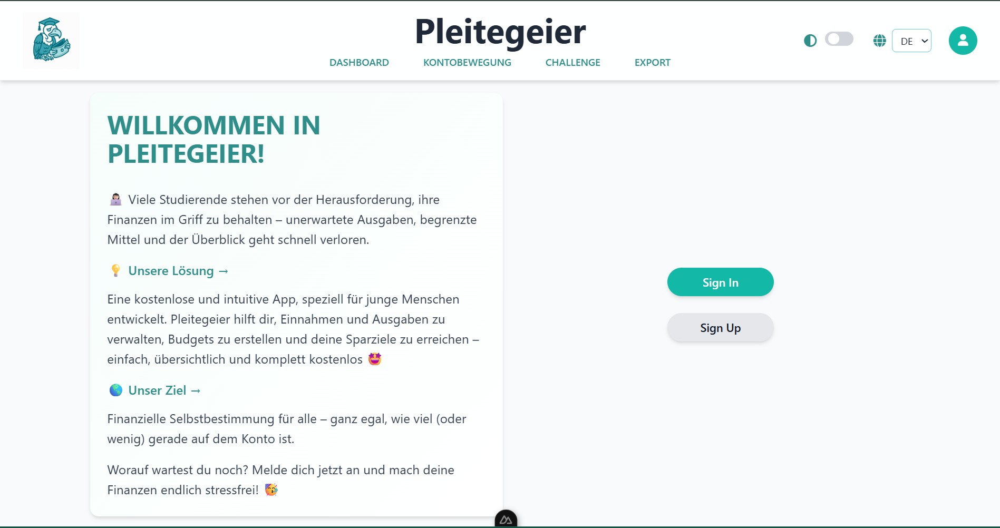

Von hier aus kannst du alle wichtigen Funktionen der App erreichen. 

=== Registrierung
Damit du den _Pleitegeier_ vollständig nutzen kannst, musst du dich zunächst registrieren und ein Konto erstellen. 

Klicke dafür auf `Sign Up` auf der Startseite.

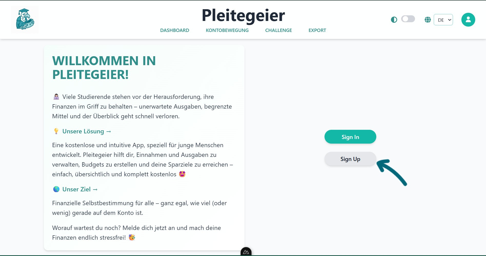

Wenn du darauf klickst, gelangst du zum Registrierungsfenster.

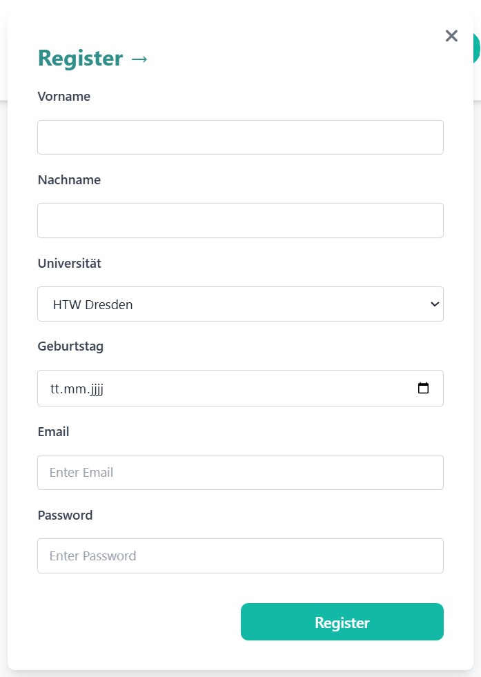 

Fülle die erforderlichen Felder aus und klicke auf `Register`. 

=== Login
Wenn du dich bei uns registriert hast, kannst du dich mit deinen Zugangsdaten anmelden.

Klicke dafür auf `Sign In` auf der Startseite.

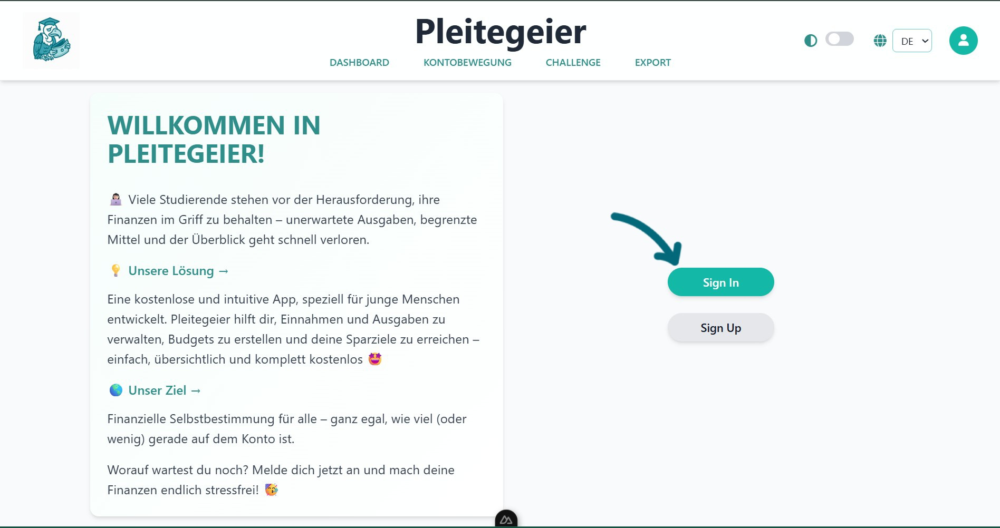 

Hier gibst du deine E-Mail-Adresse und dein Passwort ein und klickst auf `Login`.

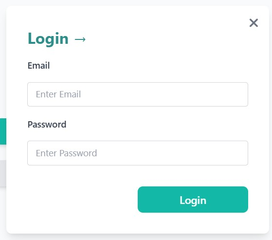

Nachdem du dich erfolgreich angemeldet hast, kannst du auf unsere Funktionen zugreifen.

=== Kontoeinstellungen 
image::Images/Konto.jpg[]

== Funktionen im Überblick
Oben findest du die Auswahl unserer Funktionen Dashboard, Kontobewegung, Challenge und Export. Klicke einfach auf die gewünschte Funktion, um loszulegen!

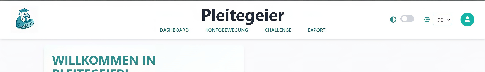

=== Dashboard
Den ersten Reiter `Dashboard` findest du ganz links.

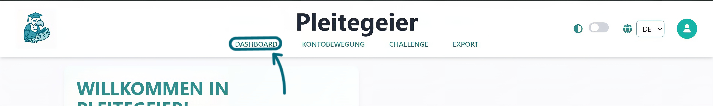

Hier bekommst du einen Überblick über deine Finanzen und grafische Auswertungen deiner Einnahmen und Ausgaben. Du kannst zum einen deinen Verlauf über verschiedene Zeiträume betrachten und zum anderen deine Einnahmen und Ausgaben in deinen Kategorien analysieren.

Ganz oben siehst du deinen aktuellen Kontostand. 

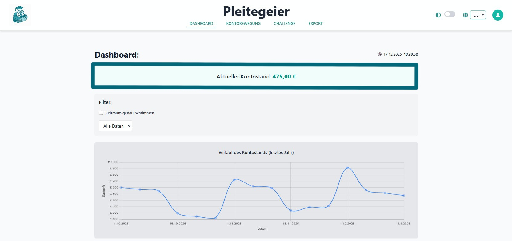

Darunter findest du verschiedene grafische Darstellungen deiner Finanzen.

Das erste Diagramm zeigt dir deinen gesamten Kontoverlauf.

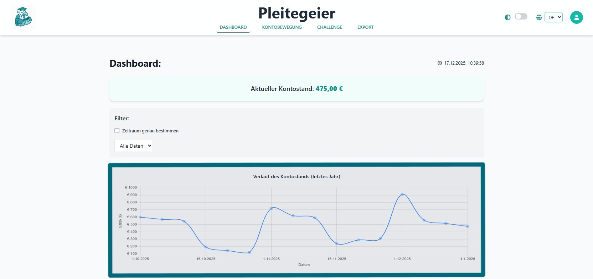

Darunter sind deine Einnahmen und Ausgaben gesondert voneinander dargestellt.

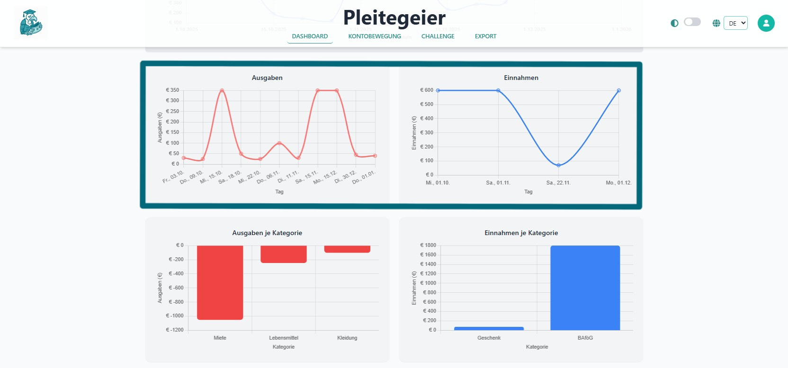

Zum Schluss findest du eine Aufschlüsselung deiner Einnahmen und Ausgaben nach Kategorien sortiert.

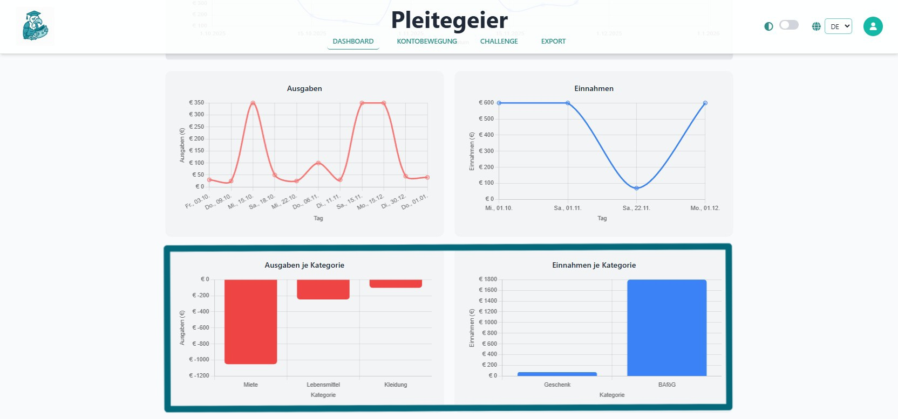

Wir haben die Diagramme interaktiv gestaltet, sodass du durch eine Auswahl verschiedene Zeiträume betrachten kannst. Unter deinem aktuellen Kontostand findest du einen Filter, mit dem du den Zeitraum auswählen kannst. 

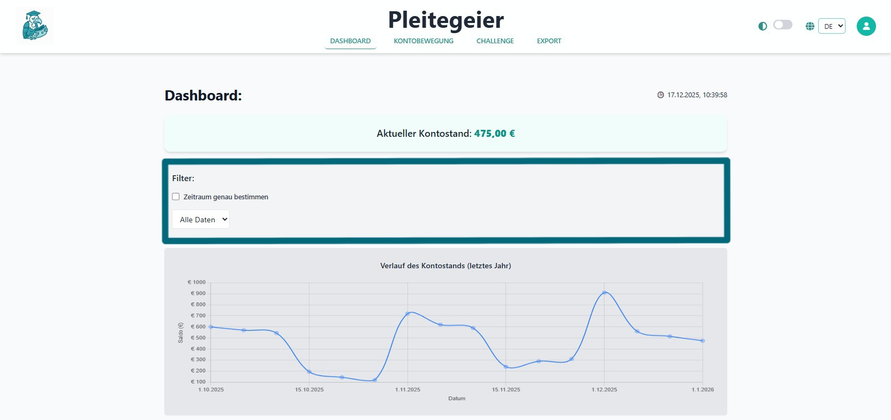

Zum einen kannst du einen speziellen Zeitraum einstellen, wenn du das möchtest. Klicke dafür auf `Zeitraum genau bestimmen` und wähle dein Start- und Enddatum aus dem Kalender aus.

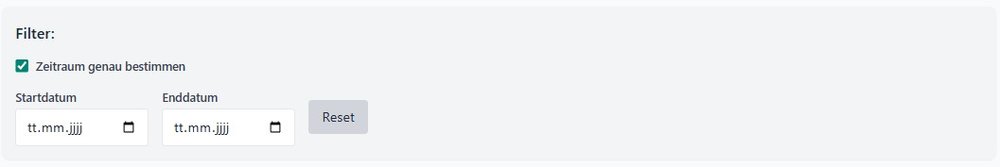

Zum anderen stehen dir 5 verschiedene Optionen zur Auswahl: Alle Daten, Woche, Monat, Semester und Jahr. Klicke einfach auf die gewünschte Option und die Diagramme werden entsprechend aktualisiert.

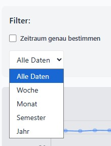

=== Kontobewegung
Unter dem zweiten Reiter findest du `Kontobewegung`.

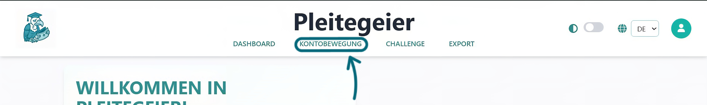

Hier kannst du deine Einnahmen und Ausgaben erfassen, Kategorien und Daueraufträge verwalten.

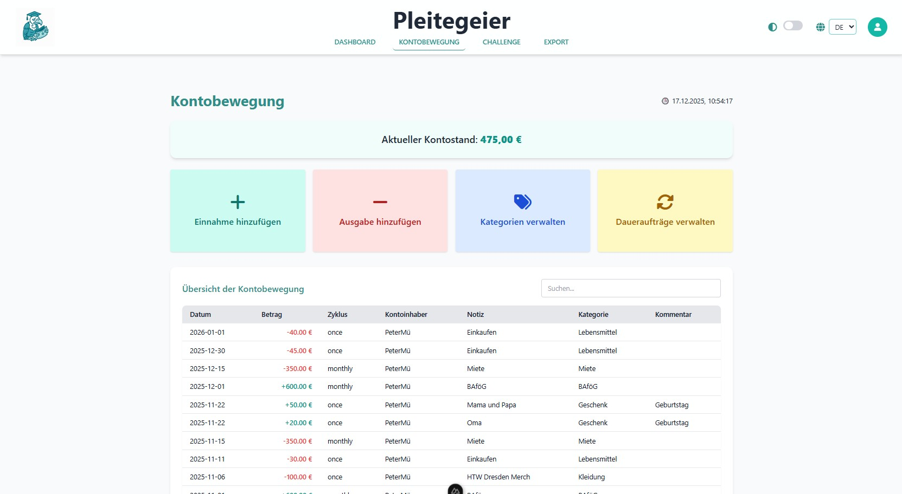

==== Einnahmen und Ausgaben erfassen
Unter `Einnahmen hinzufügen` und `Ausgaben hinzufügen` kannst du deine finanziellen Transaktionen ganz einfach eintragen.

===== Einnahmen hinzufügen
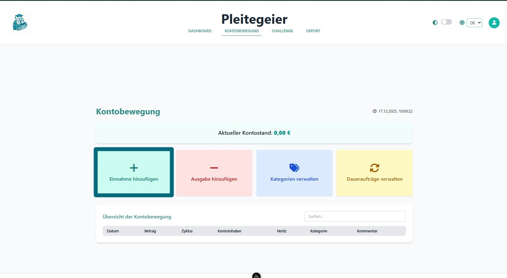

Wenn du auf `Einnahmen hinzufügen` klickst, öffnet sich ein Fenster, in dem du die Details deiner Einnahme eingeben kannst.

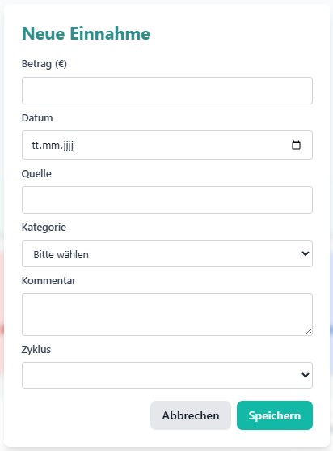

Fülle die folgenden Felder aus:

* _Betrag_: Gib den Betrag der Einnahme ein
* _Datum_: Wähle das Datum der Einnahme aus dem Kalender
* _Quelle_: Gib die Quelle der Einnahme an (z. B. Gehalt, Geschenk)
* _Kategorie_: Wähle die passende Kategorie für deine Einnahme aus dem Dropdown-Menü
* _Kommentar_: Optional kannst du einen Kommentar hinzufügen, um weitere Details zu notieren.
* _Zyklus_: Wähle aus, ob es sich um eine einmalige Einnahme handelt oder ob sie regelmäßig (z.B. monatlich) wiederholt wird.

Wenn du die Felder ausgefüllt hast, klickst du auf `Speichern`, um die Einnahme zu deiner Kontobewegung hinzuzufügen. Die Einnahme wird dann in deiner Übersicht ganz unten angezeigt und automatisch mit deinem aktuellen Kontostand verrechnet.

===== Ausgaben hinzufügen
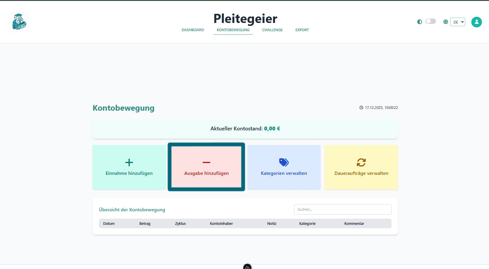

Wenn du auf `Ausgaben hinzufügen` klickst, öffnet sich ein Fenster, in dem du die Details deiner Ausgabe eingeben kannst.

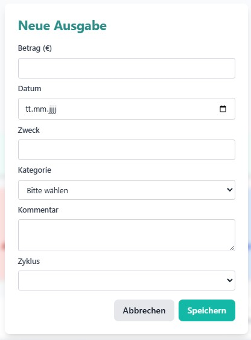

Fülle die folgenden Felder aus:

* _Betrag_: Gib den Betrag der Ausgabe ein
* _Datum_: Wähle das Datum der Ausgabe aus dem Kalender
* _Zweck_: Gib den Zweck der Ausgabe an (z.B. Miete, Lebensmittel)
* _Kategorie_: Wähle die passende Kategorie für deine Ausgabe aus dem Dropdown-Menü
* _Kommentar_: Optional kannst du einen Kommentar hinzufügen, um weitere Details zu notieren.
* _Zyklus_: Wähle aus, ob es sich um eine einmalige Ausgabe handelt oder ob sie regelmäßig (z.B. monatlich) wiederholt wird.

Wenn du die Felder ausgefüllt hast, klickst du auf `Speichern`, um die Ausgabe zu deiner Kontobewegung hinzuzufügen. Die Ausgabe wird dann in deiner Übersicht ganz unten angezeigt und automatisch mit deinem aktuellen Kontostand verrechnet.

==== Kategorien verwalten
image::Images/Kategorieverwalten.jpg[]

Wenn du auf `Kategorien verwalten` klickst, öffnet sich ein Fenster, in dem du eine Übersicht von deinen aktuellen Kategorien findest.

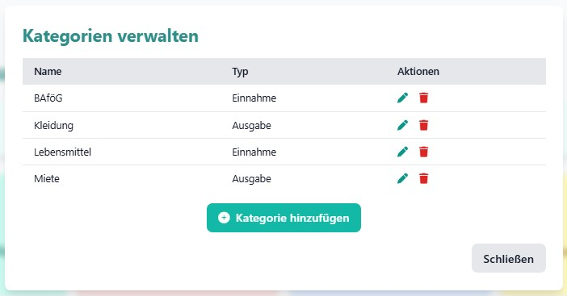

Hier kannst du neue Kategorien hinzufügen, bestehende Kategorien bearbeiten oder löschen. 

Klicke einfach auf `Kategorie hinzufügen`, um eine neue Kategorie zu erstellen. 

image::Images/Kategoriehinzufugen.jpg[]

Gib den Namen der Kategorie ein und ob es sich um eine Kategorie für Einnahmen oder Ausgaben handelt. Klicke auf `Speichern` und deine neue Kategorie wird hinzugefügt.

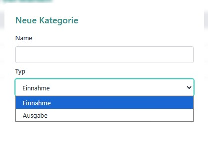

Falls du eine bestehende Kategorie bearbeiten oder löschen möchtest, klicke einfach auf das Stift-Symbol zum Bearbeiten oder das Papierkorb-Symbol zum Löschen neben der jeweiligen Kategorie.

image::Images/Kategoriestiftmull.jpg[]

Dann kannst du die Kategorie nach deinen Wünschen anpassen oder löschen.

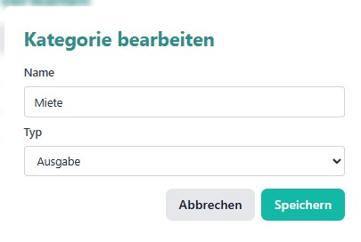 

==== Daueraufträge verwalten
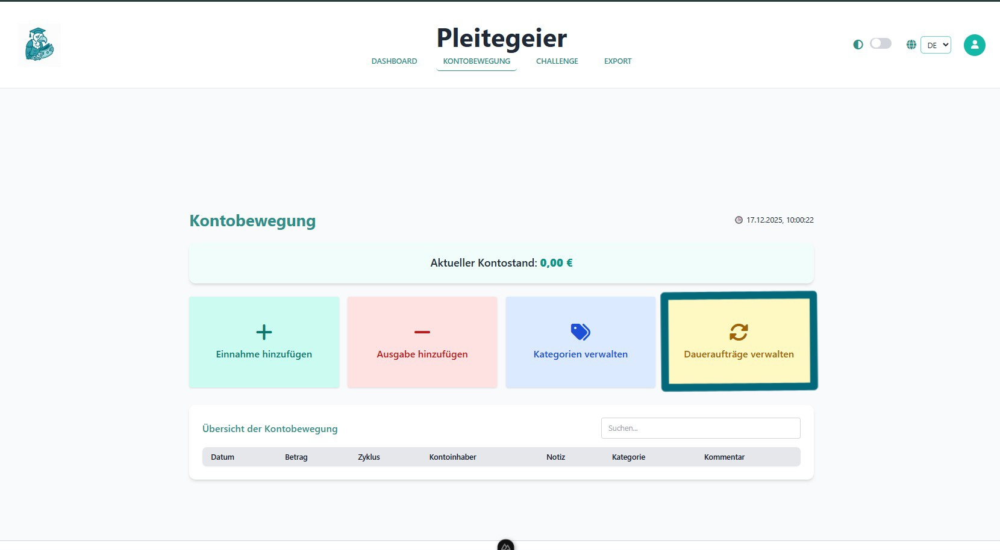

Wenn du auf `Daueraufträge verwalten` klickst, öffnet sich ein Fenster, in dem du eine Übersicht von deinen aktuellen Daueraufträgen findest.

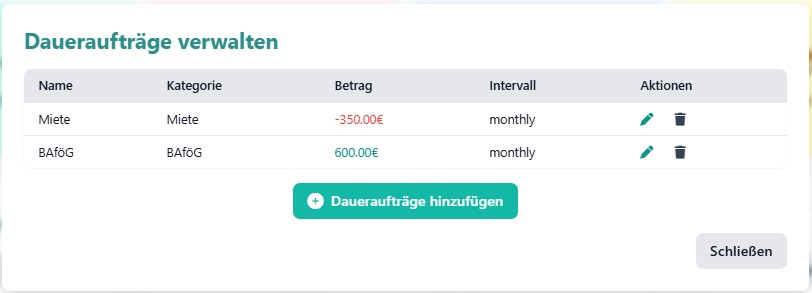

In diesem Bereich kannst du *keine* Daueraufträge hinzufügen, da diese direkt beim Erfassen von Einnahmen und Ausgaben erstellt werden. Wenn du also einen neuen Dauerauftrag anlegen möchtest, gehe zurück zu `Einnahmen hinzufügen` oder `Ausgaben hinzufügen` und wähle dort im Feld `Zyklus` die gewünschte Wiederholungsoption aus und der Dauerauftrag wird automatisch erstellt. Nach dem Speichern findest du den neuen Dauerauftrag in der Übersicht unter `Daueraufträge verwalten`.

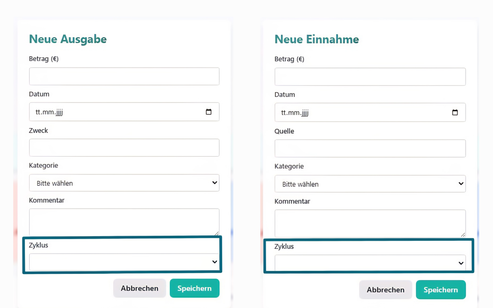

Falls du einen bestehenden Dauerauftrag bearbeiten oder löschen möchtest, klicke einfach auf das Stift-Symbol zum Bearbeiten oder das Papierkorb-Symbol zum Löschen neben dem jeweiligen Dauerauftrag.

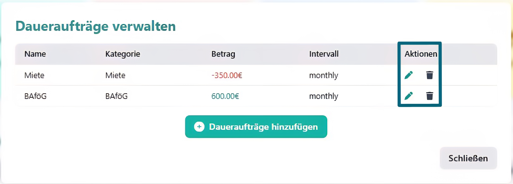

Dann kannst du die Daueraufträge nach deinen Wünschen anpassen oder löschen.

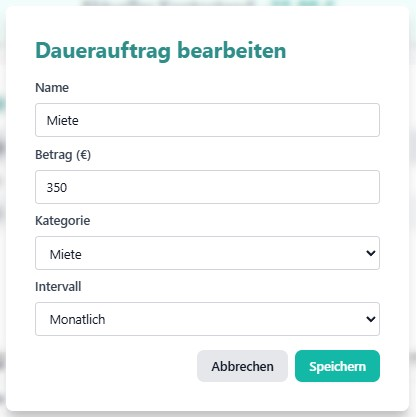

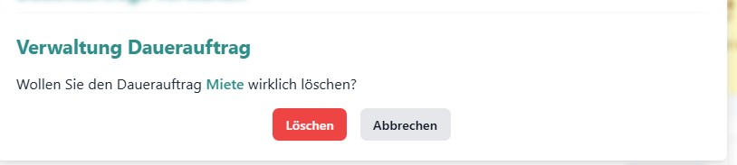

=== Challenge 

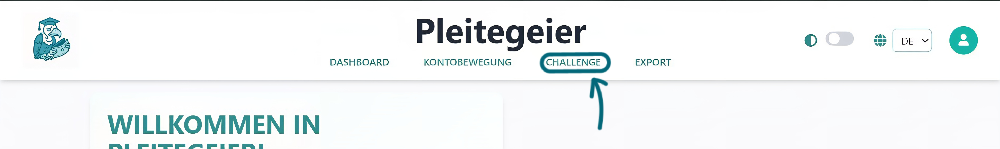

=== Export

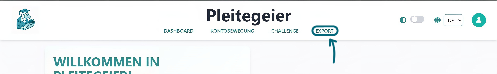

=== Weitere Funktionen
Wir haben noch einen Darkmode und Sprachwechsel eingebaut, mit denen du deine Nutzererfahrung verbessern kannst.

Der Darkmode ist das rechte der drei Symbole oben rechts.

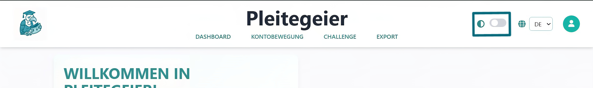

Wenn du den Schalter betätigst, wechselt die App in den Darkmode. 
Die Optik nehmen wir dir nicht vorweg, probier es einfach aus!

Der Sprachwechsel ist das mittlere Symbol oben rechts.

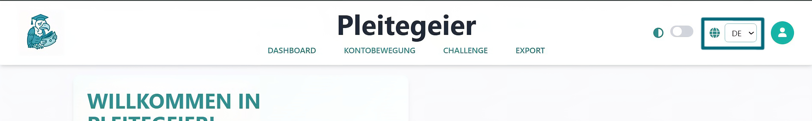

Dort hast du Deutsch und Englisch zur Auswahl. Klicke einfach auf die gewünschte Sprache und die App wird entsprechend aktualisiert.

=== FAQ
*Was passiert, wenn ich eine Einnahme oder Ausgabe versehentlich falsch eintrage?*
Das ist kein Problem! Auf der Seite `Kontobewegung` kannst du den falschen Eintrag bearbeiten oder löschen. Klicke einfach auf das Stift-Symbol zum Bearbeiten oder das Papierkorb-Symbol zum Löschen neben der jeweiligen Einnahme oder Ausgabe.

-> Bild mit umkreisung um Stift und Löschen

*Auf welchen Geräten kann ich _Pleitegeier_ nutzen (Smartphone, Tablet, Desktop)?*
Leider kann man _Pleitegeier_ derzeit nur auf Desktop-Geräten nutzen. Wir arbeiten aber daran, die App auch für mobile Geräte zu implementieren.

*Gibt es ein Limit für die Anzahl an Einnahmen, Ausgaben oder Daueraufträge, die ich anlegen kann?*
Nein, du kannst so viele Einnahmen, Ausgaben und Daueraufträge anlegen, wie du möchtest. Wir setzen dir da keine Grenzen.

*Kann ich meine Daten sichern oder später wieder importieren (z. B. nach einem Gerätewechsel)?*
Deine Daten sind bei uns in Verbindung mit deinem Konto gespeichert. Du kannst sie auf jedem neuen Gerät jederzeit wieder abrufen, solange du Zugriff auf deine Kontodaten hast.. Ein spezieller Export- oder Importmechanismus ist derzeit nicht verfügbar.

*An wen kann ich mich wenden, wenn ich einen Fehler finde oder Hilfe benötige?*
Falls du einen Fehler findest oder Hilfe benötigst, kannst du dich gerne an unser Supportteam wenden. Wir sind für dich da!